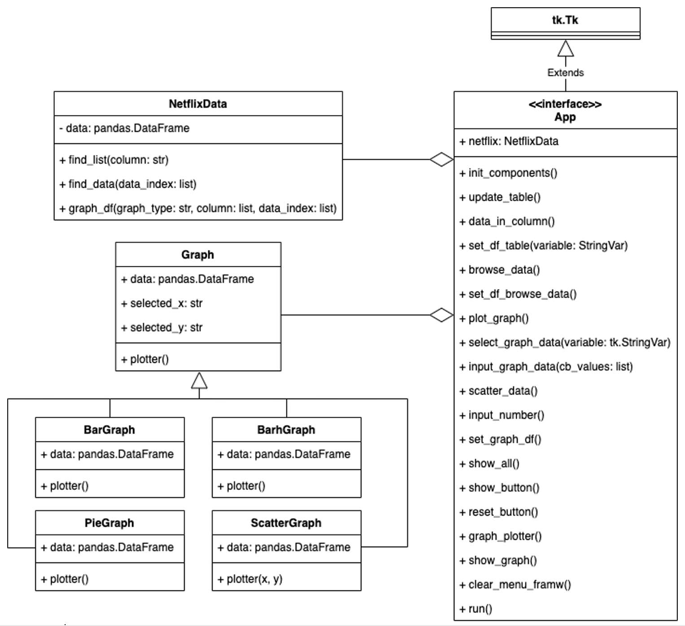

# Netflix Originals Data Analysis
 
## Description
- This program dataset contain of all Netflix original films, documentaries and specials released as of June 1st, 2021. Content included in this dataset is "Title of the film", "Genre of the film", "Original premiere date", "Runtime in minutes", "IMDB scores (as of 06/01/21)" and "Languages currently available (as of 06/01/21)"
- User can browse each column's data

- can browse about film's data individually 

- and can plot graphs from the data they selected as bar, bar (horizontal), pie and scatter graph.


Click [here](https://youtu.be/OSt3Em4tTqI) for demonstration video.
 
## Running the Application
I used 4 Python packages in this program.
* [`tkinter`](https://docs.python.org/3/library/tkinter.html) is used for create and show all program's UI.
* [`pandas`](https://pandas.pydata.org/pandas-docs/stable/) is used for data analysis.
* [`matplotlib`](https://matplotlib.org/stable/index.html) is used for set up graph.
* [`pandastable`](https://pandastable.readthedocs.io/en/latest/) is used for show the data table.

You can install all of used packages by
````
pip install -r requirements.txt
````
To run the app, please use [`main.py`](main.py).

## Design
For overall design, in this program there are 4 important files.
* [`NetflixOriginals.csv`](NetflixOriginals.csv): this file contains all Netflix originals that have been released as of June 1st, 2021.
* [`netflix_data.py`](netflix_data.py): this file contains `NetflixData`, `Graph`, `BarGraph`, `BarhGraph`, `PieGraph` and `ScatterGraph` class. 
For data analysis, the `NetflixData` class is used, while other classes are used to plot graphs.
* [`netflix_data_iu.py`](netflix_data_ui.py): this file contains `App` class which is the main class for create program's UI
  (show table, show graph etc.)
* [`main.py`](main.py): this file is used for run the program.

Here is the class diagram.


## Design Patterns Used
I used 2 design patterns in this program.
* `Template method`: I've used it to plot graphs by defining a structure in the **Graph** class and allowing other subclasses (**BarGraph**, **BarhGraph**, **PieGraph**, **ScatterGraph**) to override specific algorithms.
* `Dependency injection method`: In [netflix data ui](netflix_data_ui.py), I've created the **NetfilxData** class, which I use in the **App** class.


## Other Information
From this program, I discovered Python package called `pandastable`. It's easy to use for displaying data frames as tables on the screen. It also has many useful table functions, such as sorting data, switching columns, zooming in and out tables, etc. It still has some bugs, but it's a very good overall.